# G1C Multi-UE MIMO Channel Proxy

G1B v8 (Single-UE MIMO CUDA Graph Pipeline)을 기반으로 **N개 UE 동시 지원**을 구현한 Multi-UE Channel Proxy.

## 개요

- **DL Broadcast**: gNB의 DL 신호를 N개 UE 각각에 독립 채널 적용 후 전달
- **UL Superposition**: N개 UE의 UL 신호를 각각 채널 적용 후 합산하여 gNB에 전달
- **UL Bypass**: 채널 미적용 시 각 UE sequential copy (마지막 UE 데이터가 gNB에 도달)
- **G1B v8 최적화 계승**: CUDA Graph, CH_COPY view+release, NoiseProducer batch 사전 생성

## 아키텍처

### 전체 시스템 구조 — DL 경로

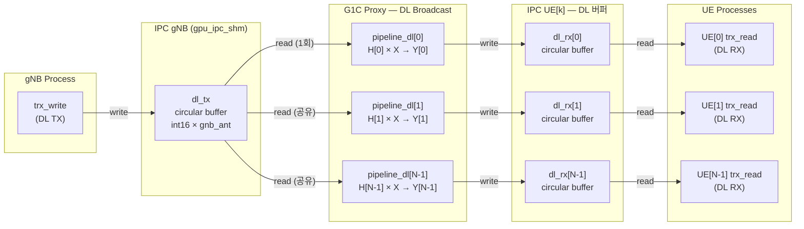

### 전체 시스템 구조 — UL 경로

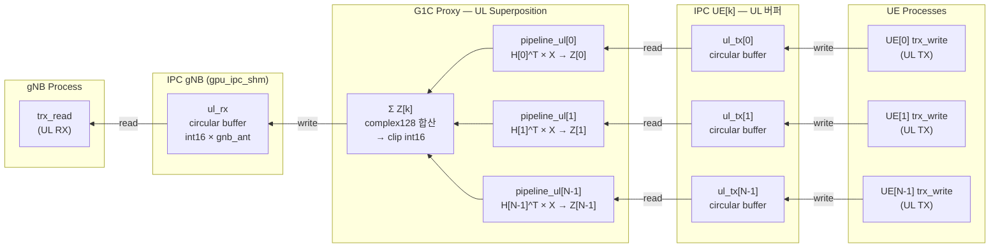

### IPC V6 Multi-Instance 전략

기존 IPC V6를 재사용하되, UE별로 독립 SHM 인스턴스를 생성:

| 인스턴스 | SHM 경로 | 사용 버퍼 | 미사용 (메모리 낭비) |
|----------|----------|-----------|---------------------|
| gNB | `/tmp/oai_gpu_ipc/gpu_ipc_shm` | dl_tx, ul_rx | dl_rx, ul_tx |
| UE[k] | `/tmp/oai_gpu_ipc/gpu_ipc_shm_ue{k}` | dl_rx, ul_tx | dl_tx, ul_rx |

### GPU Circular Buffer 구조 (IPC V6)

IPC V6의 각 버퍼는 **GPU circular buffer**로, timestamp 기반 인덱싱을 사용한다.

```
┌─────────────────────────────────────────────────────────────────────┐
│  IPC V6 인스턴스 1개 = GPU 버퍼 4개 + SHM 메타데이터 (4KB)         │
│                                                                     │
│  SHM (4KB): CUDA IPC handles × 4 + head/tail timestamps            │
│             + magic(0x47505537) + version + nbAnt per buffer        │
│                                                                     │
│  GPU Circular Buffer (per buffer):                                  │
│  ┌──────────────────────────────────────────────────────────────┐   │
│  │  cir_size = cir_time × nbAnt  (예: 460800 × 2 = 921600)    │   │
│  │                                                              │   │
│  │  int16 samples, interleaved: [s*nbAnt + a]                  │   │
│  │                                                              │   │
│  │  ◄──── cir_time (460800 samples = ~15ms @30.72MHz) ────►   │   │
│  │  ┌────┬────┬────┬────┬ ─ ─ ─ ─ ─ ─ ─ ─ ─ ┬────┬────┐      │   │
│  │  │s0a0│s0a1│s1a0│s1a1│                     │sNa0│sNa1│      │   │
│  │  └────┴────┴────┴────┴ ─ ─ ─ ─ ─ ─ ─ ─ ─ ┴────┴────┘      │   │
│  │   ▲                                                          │   │
│  │   └── offset = (timestamp % cir_time) × nbAnt               │   │
│  └──────────────────────────────────────────────────────────────┘   │
└─────────────────────────────────────────────────────────────────────┘

  s = IQ sample index (I,Q 각각 int16)
  a = antenna index (0 ~ nbAnt-1)
  nbAnt = gNB 안테나 수 (dl_tx, ul_rx) 또는 UE 안테나 수 (dl_rx, ul_tx)
```

### Multi-UE IPC 버퍼 전체 배치

G1C에서는 1개 gNB IPC + N개 UE IPC = **총 4+4N 개의 GPU circular buffer**가 할당된다.

```
GPU Memory Layout (2 UE, 2×2 MIMO 예시)
═══════════════════════════════════════════════════════════════════════

 IPC gNB (gpu_ipc_shm)                    ← Proxy가 SERVER로 생성
 ┌───────────────────────────────────┐
 │ dl_tx  [cir=921600, 2ant] ◄── gNB writes (DL 송신)
 │ dl_rx  [cir=921600, 2ant]    (미사용 — 낭비)
 │ ul_tx  [cir=921600, 2ant]    (미사용 — 낭비)
 │ ul_rx  [cir=921600, 2ant] ──► gNB reads  (UL 수신)
 └───────────────────────────────────┘

 IPC UE[0] (gpu_ipc_shm_ue0)              ← Proxy가 SERVER로 생성
 ┌───────────────────────────────────┐
 │ dl_tx  [cir=921600, 2ant]    (미사용 — 낭비)
 │ dl_rx  [cir=921600, 2ant] ──► UE[0] reads  (DL 수신)
 │ ul_tx  [cir=921600, 2ant] ◄── UE[0] writes (UL 송신)
 │ ul_rx  [cir=921600, 2ant]    (미사용 — 낭비)
 └───────────────────────────────────┘

 IPC UE[1] (gpu_ipc_shm_ue1)              ← Proxy가 SERVER로 생성
 ┌───────────────────────────────────┐
 │ dl_tx  [cir=921600, 2ant]    (미사용 — 낭비)
 │ dl_rx  [cir=921600, 2ant] ──► UE[1] reads  (DL 수신)
 │ ul_tx  [cir=921600, 2ant] ◄── UE[1] writes (UL 송신)
 │ ul_rx  [cir=921600, 2ant]    (미사용 — 낭비)
 └───────────────────────────────────┘

 총 GPU 메모리: 12 buffers × 921600 × 2B = ~21MB (이 중 6개만 사용, 6개 낭비)
```

### IQ 데이터 흐름 상세 (DL, MIMO 2×2)

gNB에서 UE까지 DL IQ 샘플이 이동하는 전체 경로:

```
OAI gNB (nr-softmodem)
  │
  │  trx_write(): DL IQ를 interleave하여 gpu_dl_tx에 기록
  │  format: int16[s*nbAnt + a]  (s=time sample, a=antenna)
  │  예: [s0_ant0, s0_ant1, s1_ant0, s1_ant1, ...]  (2-ant interleave)
  │
  ▼
┌─────────────────────────────────────────────────────────────────────┐
│  gpu_dl_tx (gNB IPC circular buffer)                                │
│  int16 × 30720×2 samples/slot = 122880 int16 per slot              │
│  timestamp head가 증가하면 Proxy가 감지                              │
└───────────────────────────┬─────────────────────────────────────────┘
                            │  Proxy: timestamp polling → new slot 감지
                            ▼
┌─────────────────────────────────────────────────────────────────────┐
│  Proxy _ipc_dl_broadcast()                                          │
│                                                                     │
│  1. gpu_circ_read: dl_tx → raw int16[30720×2]  (1회, gNB 공유)     │
│                                                                     │
│  ┌─ for k in range(N): ──────────────────────────────────────────┐  │
│  │                                                                │  │
│  │  2. de-interleave: int16[30720×2] → (30720, N_t, 2)          │  │
│  │     → complex128: (30720, N_t)                                │  │
│  │                                                                │  │
│  │  3. OFDM extract: GPU index array로 14심볼 추출               │  │
│  │     → (14, N_t, 2048)                                         │  │
│  │                                                                │  │
│  │  4. FFT: (14, N_t, 2048) → Xf (주파수 도메인)                │  │
│  │                                                                │  │
│  │  5. Channel: Yf = Σ_t H_k[s,r,t,f] × Xf[s,t,f]             │  │
│  │     H_k: (14, N_r, N_t, 2048) from RingBuffer[k]             │  │
│  │     Yf:  (14, N_r, 2048)              ← CUDA Graph replay     │  │
│  │                                                                │  │
│  │  6. IFFT: Yf → time domain (14, N_r, 2048)                   │  │
│  │                                                                │  │
│  │  7. OFDM reconstruct: GPU index scatter                       │  │
│  │     → (30720, N_r) → PL → AWGN                               │  │
│  │                                                                │  │
│  │  8. re-interleave + clip: complex128 → int16[30720×2]         │  │
│  │                                                                │  │
│  │  9. gpu_circ_write: → gpu_dl_rx[k] (UE[k] IPC)              │  │
│  └────────────────────────────────────────────────────────────────┘  │
└─────────────────────────────────────────────────────────────────────┘
                            │
          ┌─────────────────┼─────────────────┐
          ▼                 ▼                 ▼
┌──────────────┐  ┌──────────────┐  ┌──────────────┐
│ gpu_dl_rx[0] │  │ gpu_dl_rx[1] │  │gpu_dl_rx[N-1]│
│ UE[0] IPC    │  │ UE[1] IPC    │  │ UE[N-1] IPC  │
└──────┬───────┘  └──────┬───────┘  └──────┬───────┘
       ▼                 ▼                 ▼
  OAI UE[0]         OAI UE[1]        OAI UE[N-1]
  trx_read()        trx_read()        trx_read()
  de-interleave     de-interleave     de-interleave
```

### IQ 데이터 흐름 상세 (UL Channel Mode, MIMO 2×2)

N개 UE에서 gNB까지 UL IQ 샘플이 합산되어 전달되는 경로:

```
  OAI UE[0]         OAI UE[1]        OAI UE[N-1]
  trx_write()       trx_write()       trx_write()
  interleave        interleave        interleave
       │                 │                 │
       ▼                 ▼                 ▼
┌──────────────┐  ┌──────────────┐  ┌──────────────┐
│ gpu_ul_tx[0] │  │ gpu_ul_tx[1] │  │gpu_ul_tx[N-1]│
│ UE[0] IPC    │  │ UE[1] IPC    │  │ UE[N-1] IPC  │
└──────┬───────┘  └──────┬───────┘  └──────┬───────┘
       │                 │                 │
       └─────────────────┼─────────────────┘
                         │  Proxy: slowest UE criterion
                         ▼  (모든 UE timestamp ≥ target 대기)
┌─────────────────────────────────────────────────────────────────────┐
│  Proxy _ipc_ul_combine() → _ipc_ul_superposition_slot()            │
│                                                                     │
│  accum = zeros(complex128, 30720 × N_r)   ← gNB 안테나 기준        │
│                                                                     │
│  ┌─ for k in range(N): ──────────────────────────────────────────┐  │
│  │                                                                │  │
│  │  1. gpu_circ_read: ul_tx[k] → int16[30720×2]                 │  │
│  │                                                                │  │
│  │  2. de-interleave → complex128: (30720, N_t_ue)               │  │
│  │                                                                │  │
│  │  3. OFDM extract → FFT → (14, N_t_ue, 2048)                  │  │
│  │                                                                │  │
│  │  4. Channel: Zf_k = Σ_t H_k^T[s,r,t,f] × Xf[s,t,f]         │  │
│  │     H_k^T: (14, N_r_gnb, N_t_ue, 2048)    ← CUDA Graph      │  │
│  │     Zf_k:  (14, N_r_gnb, 2048)                                │  │
│  │                                                                │  │
│  │  5. IFFT → OFDM reconstruct → (30720, N_r_gnb)               │  │
│  │                                                                │  │
│  │  6. accum += pipeline_ul[k].gpu_out  (complex128 합산)        │  │
│  └────────────────────────────────────────────────────────────────┘  │
│                                                                     │
│  7. clip(accum, int16_max) → re-interleave → int16[30720×2]       │
│                                                                     │
│  8. gpu_circ_write: → gpu_ul_rx (gNB IPC)                         │
└─────────────────────────────────────────────────────────────────────┘
                            │
                            ▼
┌─────────────────────────────────────────────────────────────────────┐
│  gpu_ul_rx (gNB IPC circular buffer)                                │
│  Proxy가 timestamp 갱신 → gNB가 감지                                │
└───────────────────────────┬─────────────────────────────────────────┘
                            │
                            ▼
                      OAI gNB (nr-softmodem)
                      trx_read(): UL IQ 수신
                      de-interleave → L1 처리
```

### IQ 데이터 흐름 상세 (UL Bypass Mode)

```
  OAI UE[0]         OAI UE[1]
       │                 │
       ▼                 ▼
┌──────────────┐  ┌──────────────┐
│ gpu_ul_tx[0] │  │ gpu_ul_tx[1] │
└──────┬───────┘  └──────┬───────┘
       │                 │
       ▼                 ▼
┌─────────────────────────────────────────────────────────────────────┐
│  Proxy _ipc_ul_combine() — bypass mode                              │
│                                                                     │
│  for k in range(N):                                                 │
│    bypass_copy: gpu_ul_tx[k] ──copy──► gpu_ul_rx (gNB)             │
│                                                                     │
│  ※ 채널 미적용, 각 UE가 순차적으로 gNB ul_rx를 덮어씀               │
│  ※ 최종적으로 UE[N-1]의 데이터만 gNB에 유효                         │
└───────────────────────────┬─────────────────────────────────────────┘
                            ▼
                      gpu_ul_rx (gNB IPC)
                            │
                            ▼
                      OAI gNB trx_read()
```

### Timestamp Polling 메커니즘

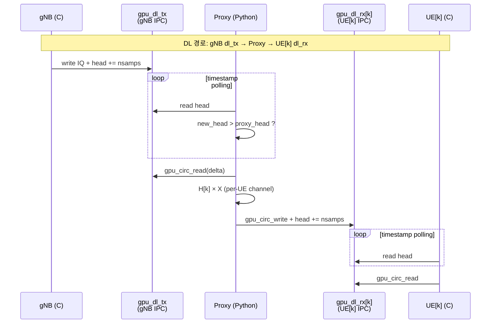

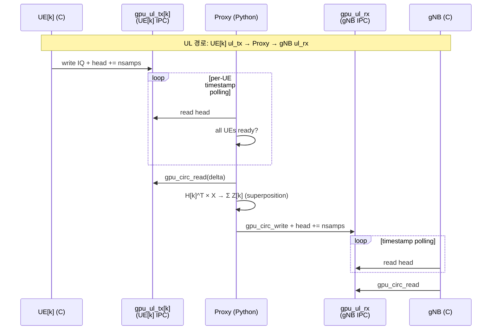

### GPU 버퍼 구조 (Per-UE 리소스 맵)

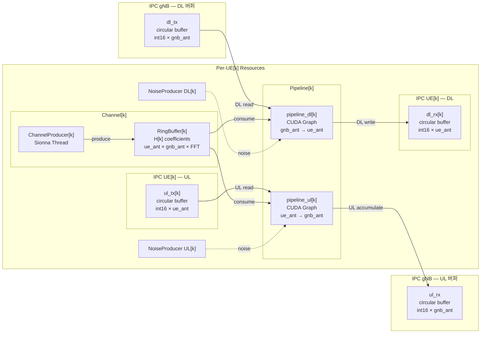

### DL Broadcast 흐름

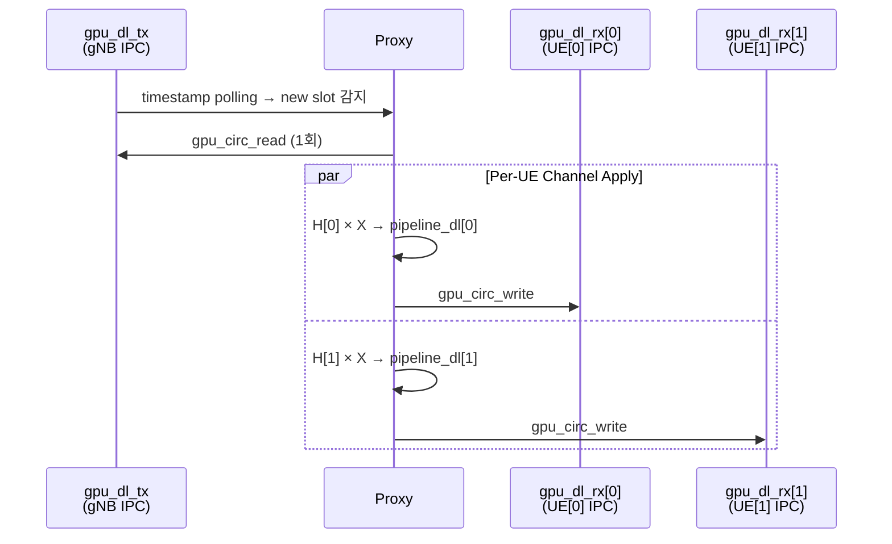

### UL Superposition 흐름 (Channel Mode)

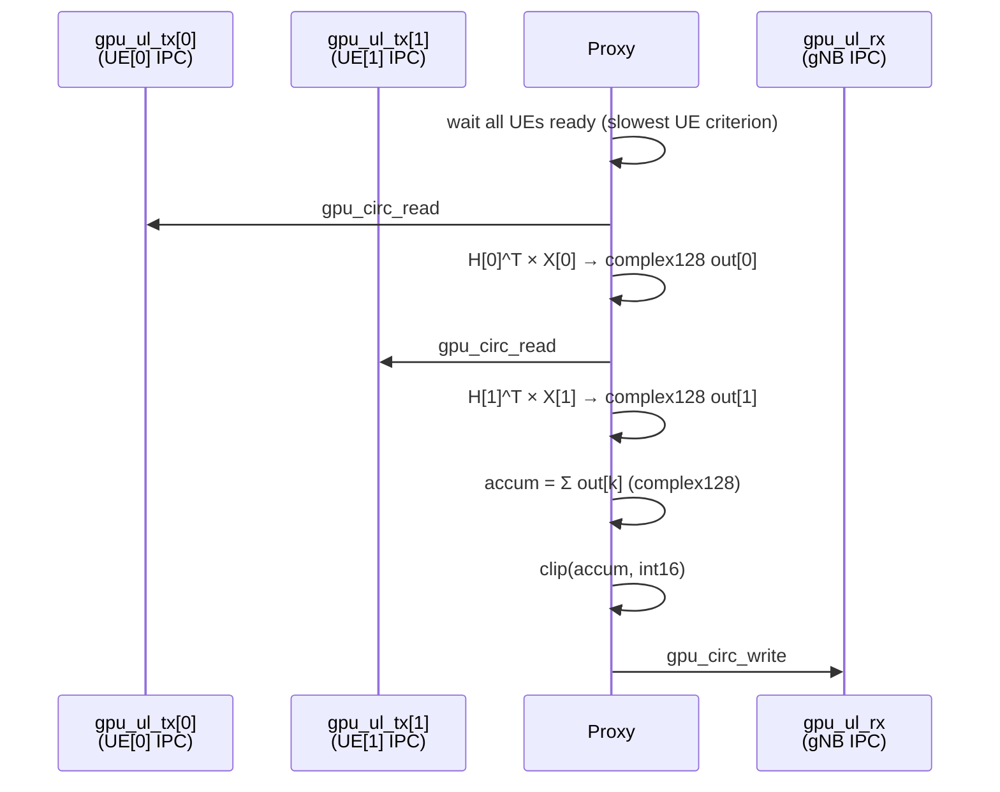

### UL Bypass 흐름

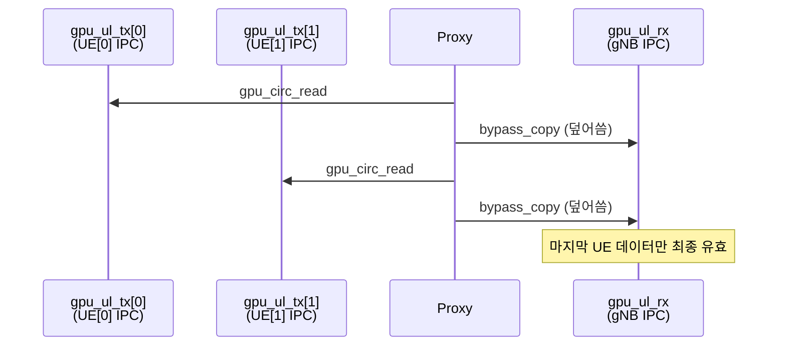

## Per-UE 독립 리소스

각 UE는 완전히 독립된 리소스를 가짐:

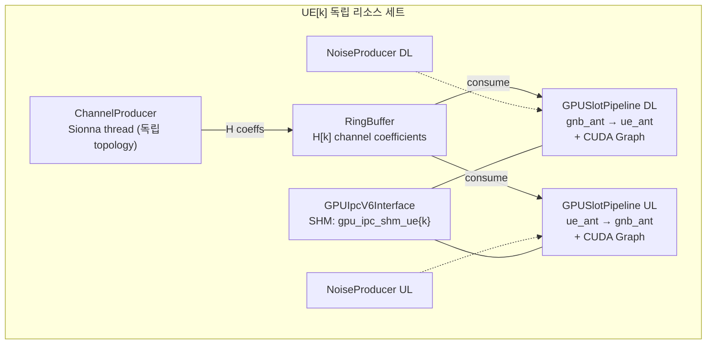

## C 코드 변경 (gpu_ipc_v6)

`gpu_ipc_v6.c`의 `gpu_ipc_v6_init()`에서 UE 역할일 때 `RFSIM_GPU_IPC_UE_IDX` 환경변수를 읽어 per-UE SHM 경로 생성:

```c
// UE role: RFSIM_GPU_IPC_UE_IDX=k → /tmp/oai_gpu_ipc/gpu_ipc_shm_ue{k}
// gNB role: 기본 경로 유지 → /tmp/oai_gpu_ipc/gpu_ipc_shm
```

`gpu_ipc_v6_ctx_t`에 `char shm_path[256]` 필드 추가.

**빌드 필요**: C 코드 변경 후 OAI 재빌드 필수.

```bash
cd ~/DevChannelProxyJIN/openairinterface5g_whan/cmake_targets
./build_oai --gNB --nrUE -w SIMU --ninja --build-lib "telnetsrv"
```

## 파일 구조

```
G1C_MultiUE_MIMO_Channel_Proxy/
├── v0.py                        # Multi-UE proxy (G1B v8 기반)
├── launch_all.sh                # 통합 런처 (gNB + N UE + Proxy)
├── channel_coefficients_JIN.py  # Sionna 채널 계수 생성기
├── README.md                    # 이 문서
├── v0.py.bak                    # 백업
└── launch_all.sh.bak            # 백업
```

## 실행 방법

### 사전 조건

1. OAI 재빌드 (C 코드 변경 반영)
2. Sionna Docker 컨테이너 (`sionna-proxy`) 실행 중
3. GPU (CUDA) 사용 가능

### 검증 명령어

**Test 1: 1 UE, SISO Bypass (G1B 호환성 확인)**
```bash
sudo bash launch_all.sh -v v0 -m gpu-ipc -b -n 1
```

**Test 2: 1 UE, 2x2 MIMO Channel**
```bash
sudo bash launch_all.sh -v v0 -m gpu-ipc -ga 2 1 -ua 2 1 -n 1
```

**Test 3: 2 UEs, SISO Bypass**
```bash
sudo bash launch_all.sh -v v0 -m gpu-ipc -b -n 2
```

**Test 4: 2 UEs, 2x2 MIMO Bypass**
```bash
sudo bash launch_all.sh -v v0 -m gpu-ipc -b -ga 2 1 -ua 2 1 -n 2
```

**Test 5: 2 UEs, 2x2 MIMO Channel (DL broadcast + UL superposition)**
```bash
sudo bash launch_all.sh -v v0 -m gpu-ipc -ga 2 1 -ua 2 1 -n 2
```
# N=4 정적 채널 기준 테스트 (기존 dynamic과 비교)
```bash
sudo bash launch_all.sh -n 4 -cm static -ga 2 1 -ua 2 1

# N=8 스케일링 테스트
sudo bash launch_all.sh -n 8 -cm static -ga 2 1 -ua 2 1

# N=16 스케일링 테스트
sudo bash launch_all.sh -n 16 -cm static -ga 2 1 -ua 2 1

# N=32 스케일링 (배치 8개씩)
sudo bash launch_all.sh -n 32 -cm static -bs 8 -ga 2 1 -ua 2 1

# N=64 최대 스케일링
sudo bash launch_all.sh -n 64 -cm static -bs 8 -ga 2 1 -ua 2 1
### 확인 사항

- `proxy.log`: 모든 UE IPC 초기화 성공 메시지 확인
- `gnb.log`: gNB DL/UL 정상 동작 확인
- `ue{k}.log`: 각 UE의 PSS/SSS 검출 및 동기화 확인
- `nrMAC_stats.log`: CQI/MCS/BLER 확인 (2 UE 모두 스케줄링)

## 실험 결과 (2026-03-12, H100 NVL)

### Test 결과 요약

| Test | 구성 | 결과 | DL Rate | Proxy/slot | UE 상태 |
|:----:|------|:----:|--------:|-----------:|---------|
| 1 | 1UE SISO bypass | **PASS** | 1567.7/s | 0.15 ms | in-sync |
| 2 | 1UE 2x2 channel | **PASS** | 323.9/s | ~1.0 ms | in-sync, RI=2 |
| 3 | 2UE SISO bypass | **PASS** | 1253.9/s | 0.27 ms | UE0 out-of-sync*, UE1 in-sync |
| 4 | 2UE 2x2 bypass | **PASS** | 1030.1/s | 0.24 ms | UE0 in-sync, UE1 연결됨 |
| 5 | 2UE 2x2 channel | **PASS** | 187.2/s | ~1.8 ms | **2UE 모두 in-sync, RI=2** |

\* Test 3~4 UE0 out-of-sync은 bypass UL 설계 특성 (마지막 UE 데이터만 gNB에 유효)

### 성능 상세

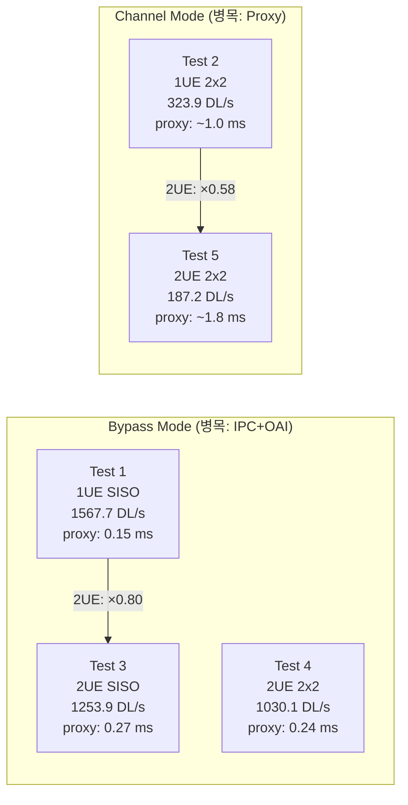

### Per-Slot 타이밍 분석

| Test | Proxy DL (ms) | Proxy UL (ms) | IPC+OAI (ms) | Wall (ms) | 병목 |
|:----:|:-------------:|:-------------:|:------------:|:---------:|:----:|
| 1 | 0.15 | 0.00 | 0.37 | 0.53 | IPC+OAI |
| 2 | ~0.5 | ~0.5 | 0.02 | ~1.0 | Proxy |
| 3 | 0.27 | 0.00 | 0.35 | 0.62 | IPC+OAI |
| 4 | 0.24 | 0.00 | 0.54 | 0.79 | IPC+OAI |
| 5 | ~0.7 | ~1.1 | 0.02 | ~1.8 | Proxy |

### 병목 구조 분석

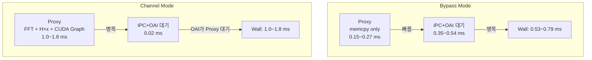

### Multi-UE 스케일링

| 비교 | 1UE | 2UE | Proxy 비율 | Rate 비율 |
|------|:---:|:---:|:----------:|:---------:|
| SISO bypass | 0.15 ms | 0.27 ms | **×1.8** | ×0.80 |
| 2x2 channel | ~1.0 ms | ~1.8 ms | **×1.8** | ×0.58 |

Proxy 처리 시간은 UE 수에 ~1.8배 비례 (이론 2.0배보다 낮음 — gNB dl_tx 읽기 등 공유 연산).

### 실시간 가능성 (5G NR SCS 30kHz 기준: 1 slot = 0.5ms)

| Test | Proxy/slot | 0.5ms 대비 | 실시간 |
|:----:|:----------:|:----------:|:------:|
| 1 (1UE SISO bypass) | 0.15 ms | 30% | **가능** |
| 3 (2UE SISO bypass) | 0.27 ms | 54% | **가능** |
| 4 (2UE 2x2 bypass) | 0.24 ms | 48% | **가능** |
| 2 (1UE 2x2 channel) | ~1.0 ms | 200% | 2× 초과 |
| 5 (2UE 2x2 channel) | ~1.8 ms | 360% | 3.6× 초과 |

### Test 5 상세 (핵심 — 2UE MIMO Channel)

| 항목 | UE0 (62f2) | UE1 (5a58) |
|------|:----------:|:----------:|
| 동기화 | **in-sync** | **in-sync** |
| CQI | 15 | 15 |
| RI | **2** | **2** |
| PMI | (0,1) | (0,0) |
| DL BLER | 5.3% | 9.2% |
| UL BLER | 5.6% | 1.3% |
| UL SNR | 20.0 dB | 61.5 dB |

PMI가 UE별로 다른 것은 독립 채널 적용이 정상 동작하는 증거. RI=2는 MIMO 경로 인식 성공.

## G1B v8 대비 변경사항

| 항목 | G1B v8 | G1C v0 |
|------|--------|--------|
| UE 수 | 1 | N (--num-ues) |
| IPC 인스턴스 | 1 | 1 + N |
| SHM 파일 | gpu_ipc_shm | gpu_ipc_shm + gpu_ipc_shm_ue{k} |
| DL 처리 | 1:1 | 1:N broadcast |
| UL 처리 | 1:1 | N:1 superposition/bypass |
| 파이프라인 | DL 1개 + UL 1개 | DL N개 + UL N개 |
| 채널 생성 | 1 producer | N producers |
| GPU 메모리 | 4 buffers | 4 + 4N buffers |
| C 코드 | gpu_ipc_v6 | + RFSIM_GPU_IPC_UE_IDX 지원 |

## GPU Batch Parallel Processing

Static 채널 모드 + 2개 이상 UE 시 자동 활성화되는 GPU 배치 병렬 처리 최적화.

### 핵심 원리

**순차 처리 (기존)**:
```
DL: for k in 0..N-1: FFT(input) → H[k]*X → IFFT → UE[k]     # N번 FFT 반복
UL: for k in 0..N-1: FFT(UE[k]) → H_ul[k]*X → IFFT → accum   # N번 순차 처리
```

**배치 처리 (최적화)**:
```
DL: FFT(input) 1회 → H_batch[0..N-1]*X 동시 → IFFT(batch) → UE[0..N-1]
UL: stack(UE[0..N-1]) → FFT(batch) → H_ul_batch*X → sum → gNB
```

### 성능 이점

| 항목 | 순차 (N=32, 4T4R) | 배치 (N=32, 4T4R) |
|------|:------------------:|:-----------------:|
| DL FFT 호출 | 32회 × 56개 FFT | 1회 × 56개 FFT |
| DL H*X 곱셈 | 32회 순차 | 1회 배치 (GPU 병렬) |
| UL FFT 호출 | 32회 × 56개 FFT | 1회 × 1792개 FFT (배치) |
| Python for-loop | 32 iterations | 4 iterations (n_tx) |
| GPU 활용도 | 낮음 (작은 커널 반복) | 높음 (큰 배치 커널) |

### 활성화 조건

- `--channel-mode static` (정적 채널)
- `--num-ues >= 2`
- `--custom-channel` (채널 적용 모드)
- GPU 사용 가능

### GPU 메모리 사용량

| UE 수 | 안테나 | H_dl 배치 텐서 | 추가 메모리 (추정) |
|:------:|:------:|:--------------:|:-----------------:|
| 8 | 4T4R | ~58 MiB | ~100 MiB |
| 32 | 4T4R | ~230 MiB | ~400 MiB |
| 64 | 4T4R | ~460 MiB | ~800 MiB |

### 동작 확인

프록시 로그에서 다음을 확인:
```
[BATCH] GPU batch processing enabled: 32 UEs, H_dl=[32, 14, 4, 4, 2048], 230 MiB, 0.1s
[G1C] Entering main loop (32 UE(s), gnb_ant=4, ue_ant=4, BATCH)...
```

## 안테나 및 편파 설정

### OAI gNB 안테나 포트 구조

OAI gNB의 PDSCH 논리 안테나 포트 수는 `gnb.conf`의 3개 파라미터로 결정된다:

```
총 논리 포트 = N1 × N2 × XP
```

| 파라미터 | 설명 | 위치 (`gnb.conf`) |
|----------|------|:-----------------:|
| `pdsch_AntennaPorts_N1` | 수평 공간 포트 수 | 현재값: **2** |
| `pdsch_AntennaPorts_N2` | 수직 공간 포트 수 | 현재값: **1** |
| `pdsch_AntennaPorts_XP` | 편파 수 (1=단일, 2=교차) | 현재값: **1** |
| `nb_tx` | 물리 TX 안테나 수 | 현재값: **4** |

`nb_tx`는 총 논리 포트 수 **이상**이어야 한다.

### 교차 편파(XP)에 따른 포트 매핑

**XP=1 (단일 편파) — 현재 설정**:

```
N1=2, N2=1, XP=1 → 2 논리 포트

    V 편파만
    ┌─────────┐
    │ Port 0  │  ← 공간 위치 0
    │ Port 1  │  ← 공간 위치 1
    └─────────┘

물리 안테나 4개 중 2개만 논리 포트로 사용.
나머지 2개는 gNB 내부 빔포밍에 활용 가능.
```

**XP=2 (교차 편파) — 4포트 MIMO 시 필요**:

```
N1=2, N2=1, XP=2 → 4 논리 포트

    +45° 편파       -45° 편파
    ┌─────────┐    ┌─────────┐
    │ Port 0  │    │ Port 2  │  ← 공간 위치 0, 같은 물리 위치
    │ Port 1  │    │ Port 3  │  ← 공간 위치 1, 같은 물리 위치
    └─────────┘    └─────────┘

Port 0 ↔ Port 2: 같은 위치, 다른 편파 → 채널 상관 낮음 (XPR)
Port 1 ↔ Port 3: 같은 위치, 다른 편파 → 채널 상관 낮음 (XPR)
```

교차 편파의 핵심 이점: **같은 공간 위치에서 편파 다이버시티를 얻어 Rank 2+ 전송 성능이 향상**된다. 편파 간 상관은 3GPP 38.901의 XPR(Cross-Polarization Ratio)로 모델링되며, 전파 환경에 따라 7~9 dB 수준이다.

### Sionna 채널 모델의 편파 설정

프록시의 `v0.py`에서 Sionna `PanelArray` 생성 시 편파 설정:

```python
# gNB TX 배열 (set_BS 기본값)
set_BS(num_rows_per_panel=gnb_ny, num_cols_per_panel=gnb_nx,
       polarization="single",    # ← 단일 편파
       polarization_type="V")    # ← 수직 편파만

# UE RX 배열
ArrayRX = PanelArray(
    num_rows_per_panel=ue_ny, num_cols_per_panel=ue_nx,
    polarization='single', polarization_type='V')
```

**현재 `polarization='single'` 설정의 의미**:

`-ga 2 2` (gnb_ny=2, gnb_nx=2)로 실행 시:

```
Sionna가 실제로 생성하는 안테나 배열:

    V 편파만 (단일 편파)
        col 0    col 1
row 0  [ ant_0 ] [ ant_1 ]  ← 모두 V 편파
row 1  [ ant_2 ] [ ant_3 ]  ← 모두 V 편파

→ 4개 안테나, 4개 공간 위치, 편파 다이버시티 없음
```

채널 매트릭스 H: `(N_SYM, ue_ant, gnb_ant, FFT_SIZE)` — 4개 TX 안테나 모두 동일한 편파 특성을 가진 채널이 생성된다.

### 교차 편파 불일치 문제

OAI에서 `XP=2`로 설정하면서 Sionna 채널이 `polarization='single'`이면 **포트-채널 매핑이 불일치**한다:

| OAI 포트 | OAI의 기대 | Sionna 실제 생성 | 문제 |
|:--------:|------------|-----------------|------|
| Port 0 | 공간0, +45° 편파 | 공간(0,0), V 편파 | - |
| Port 1 | 공간1, +45° 편파 | 공간(0,1), V 편파 | - |
| Port 2 | 공간0, **-45° 편파** | 공간(1,0), **V 편파** | **편파 다이버시티 없음** |
| Port 3 | 공간1, **-45° 편파** | 공간(1,1), **V 편파** | **편파 다이버시티 없음** |

**결과**:
- Port 2,3의 채널이 Port 0,1과 편파가 다르지 않고 공간만 다름
- OAI 프리코더가 교차 편파 코드북으로 PMI를 계산하지만 채널에 편파 분리가 없음
- CSI 보고(RI, PMI, CQI)가 실제 채널과 일치하지 않음
- Rank 2+ 전송에서 편파 멀티플렉싱 이득을 얻을 수 없음

### 편파 모드 전환 (구현 완료)

`launch_all.sh`의 `-pol` 옵션으로 단일/교차 편파를 런타임에 선택할 수 있다:

```bash
# 단일 편파 (기본값) — XP=1
sudo bash launch_all.sh -ga 2 2 -ua 2 2
# → Sionna: single-pol, 2×2=4 ant, OAI: N1=4,XP=1

# 교차 편파 — XP=2
sudo bash launch_all.sh -ga 2 1 -ua 2 1 -pol dual
# → Sionna: dual-pol (cross ±45°), 2×1×2=4 ant, OAI: N1=2,XP=2
```

#### 내부 동작

`-pol dual` 지정 시 자동으로 연동되는 설정:

| 항목 | `-pol single` (기본) | `-pol dual` |
|------|:-------------------:|:-----------:|
| Sionna `polarization` | `"single"` | `"dual"` |
| Sionna `polarization_type` | `"V"` | `"cross"` |
| 안테나 수 계산 | `NX × NY` | `NX × NY × 2` |
| gNB ArrayTX | 공간 분리만 | 공간 + XPR 편파 |
| UE ArrayRX | 공간 분리만 | 공간 + XPR 편파 |
| IPC 버퍼 크기 | `NX*NY` 기준 | `NX*NY*2` 기준 |
| OAI `pdsch_AntennaPorts_XP` | `1` | `2` |
| OAI `pdsch_AntennaPorts_N1` | 전체 안테나 수 | 공간 포트 수 (`NX*NY`) |

`polarization='dual'`로 변경하면 Sionna의 `ChannelCoefficientsGeneratorJIN`이 XPR 파라미터(`mean_xpr`, `stddev_xpr`)를 사용하여 편파 간 채널 결합을 올바르게 생성한다. 현재 코드에 이미 XPR 파라미터가 정의되어 있다:

```python
mean_xpr_list = {"UMi-LOS": 9, "UMi-NLOS": 8, "UMa-LOS": 8, "UMa-NLOS": 7}
stddev_xpr_list = {"UMi-LOS": 3, "UMi-NLOS": 3, "UMa-LOS": 4, "UMa-NLOS": 4}
mean_xpr = mean_xpr_list["UMa-NLOS"]   # 7 dB
stddev_xpr = stddev_xpr_list["UMa-NLOS"] # 4 dB
```

`-pol single`일 때 이 파라미터는 Rays의 `xpr` 필드에 전달되지만 편파 간 채널 분리에 영향을 주지 않는다. `-pol dual`일 때는 3GPP 38.901 기반 XPR이 반영된다.

#### 주의: 두 모드는 호환 불가

Sionna `PanelArray`는 편파에 따라 안테나 수를 결정한다:

```python
p = 1 if polarization == 'single' else 2
num_panel_ant = num_cols_per_panel * num_rows_per_panel * p
```

따라서 `-pol dual`로 설정하면 모든 관련 코드(IPC 버퍼, 파이프라인, OAI)가 `×2` 안테나 수에 맞춰야 하며, `-pol single`과 동일 환경에서 혼용할 수 없다.

### 안테나 설정 옵션 요약 (`launch_all.sh`)

| CLI 옵션 | 의미 | 예시 |
|----------|------|------|
| `-ga <ny> <nx>` | gNB 안테나 rows × cols | `-ga 2 2` → 4 (single) |
| `-ua <ny> <nx>` | UE 안테나 rows × cols | `-ua 2 2` → 4 (single) |
| `-pol <mode>` | 편파 모드: single / dual | `-pol dual` → ant×2 |

| 구성 | 런처 옵션 | Sionna 설정 | OAI gnb.conf | 채널 매트릭스 |
|------|---------|-------------|:------------:|:----------:|
| 2T2R | `-ga 2 1 -ua 2 1` | 2×1 single | N1=2,XP=1 | H(2,2,FFT) |
| 4T4R (공간) | `-ga 2 2 -ua 2 2` | 2×2 single | N1=4,XP=1 | H(4,4,FFT) |
| 4T4R (XP) | `-ga 2 1 -ua 2 1 -pol dual` | 2×1 dual | N1=2,XP=2 | H(4,4,FFT) |
| 8T8R (XP) | `-ga 2 2 -ua 2 2 -pol dual` | 2×2 dual | N1=4,XP=2 | H(8,8,FFT) |

## 알려진 제한사항 (v0)

- **GPU 메모리 낭비**: 각 IPC 인스턴스가 4 버퍼를 할당하지만 2개만 사용 (v0 단순화)
- **UL 노이즈 위치**: 수신기(gNB) 노이즈가 아닌 per-UE 노이즈 (물리적으로 부정확하지만 v0 허용)
- **채널 독립성**: 모든 UE가 동일한 PDP 기반 (위치/속도만 랜덤)
- **UL 타이밍**: slowest UE 기준으로 처리 — 느린 UE가 전체 UL 처리 지연 가능
- **Socket 모드**: Multi-UE 미지원 (GPU IPC 모드 전용)
- **배치 모드**: static 채널 모드에서만 지원 (dynamic 채널 모드는 순차 처리)
- **편파 전환**: `-pol dual` 사용 시 포트 매핑(Sionna↔OAI) 순서 검증 필요 — 포트 순서 불일치 가능성 존재
- **ChannelProducer 스파이크**: 2+ UE에서 TF GPU 경합으로 간헐적 처리 지연 (최대 ~25ms/slot)
