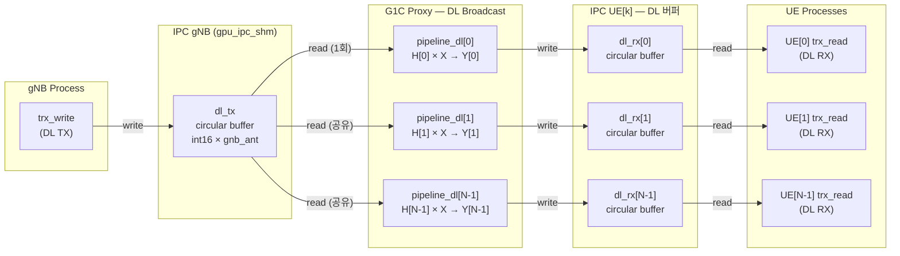
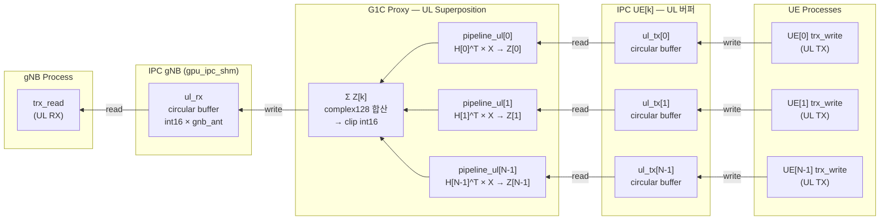
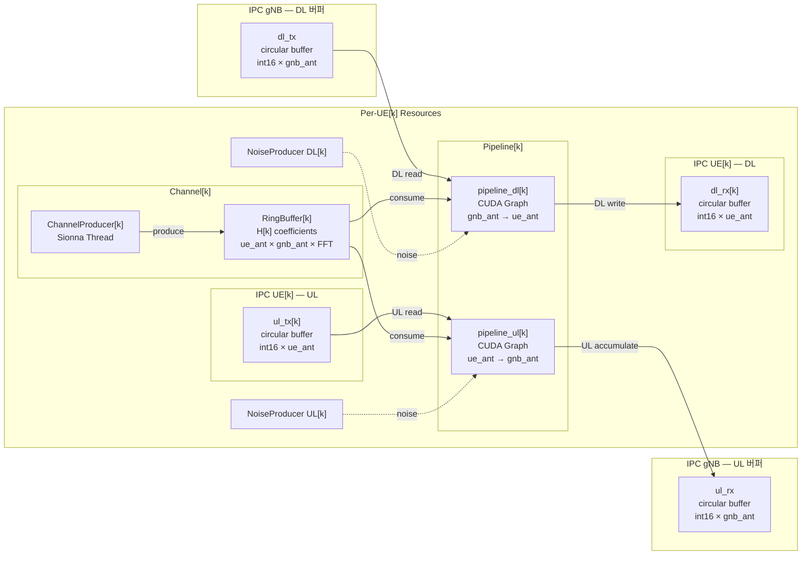

# G1C Multi-UE MIMO Channel Proxy

G1B v8 (Single-UE MIMO CUDA Graph Pipeline)을 기반으로 **N개 UE 동시 지원**을 구현한 Multi-UE Channel Proxy.

## 목차

- [개요](#개요)
- [빠른 시작](#빠른-시작)
- [아키텍처 개요](#아키텍처-개요)
- [버전 히스토리](#버전-히스토리)
- [성능 요약](#성능-요약)
- [파일 구조](#파일-구조)
- [알려진 제한사항](#알려진-제한사항)
- [미해결 과제](#미해결-과제)
- [상세 문서](#상세-문서)

## 개요

- **DL Broadcast**: gNB의 DL 신호를 N개 UE 각각에 독립 채널 적용 후 전달
- **UL Superposition**: N개 UE의 UL 신호를 각각 채널 적용 후 합산하여 gNB에 전달
- **UL Bypass**: 채널 미적용 시 각 UE sequential copy (마지막 UE 데이터가 gNB에 도달)
- **G1B v8 최적화 계승**: CUDA Graph, CH_COPY view+release, NoiseProducer batch 사전 생성

## 빠른 시작

### 사전 조건

1. OAI 재빌드 (C 코드 변경 반영)
2. Sionna Docker 컨테이너 (`sionna-proxy`) 실행 중
3. GPU (CUDA) 사용 가능

### 기본 실행 (v4 권장)

**2 UEs, 2×2 MIMO Channel (권장 구성)**:
```bash
sudo bash launch_all.sh -v v4 -m gpu-ipc -ga 2 1 -ua 2 1 -n 2 -bs 280 \
  -p1b ../P1B_Valid_Results/Area1_7.5GHz_Rays_Valid_RXs.npz -rx 98,498
```

**1 UE, 2×2 MIMO Channel**:
```bash
sudo bash launch_all.sh -v v4 -m gpu-ipc -ga 2 1 -ua 2 1 -n 1 -bs 280 \
  -p1b ../P1B_Valid_Results/Area1_7.5GHz_Rays_Valid_RXs.npz -rx random
```

**2 UEs, SISO Bypass (채널 미적용, 기본 연결 테스트)**:
```bash
sudo bash launch_all.sh -v v4 -m gpu-ipc -b -n 2
```

### 주요 CLI 옵션

| 옵션 | 설명 | 기본값 |
|------|------|--------|
| `-v` | Proxy 버전 (v0~v4) | — |
| `-m` | 모드 (gpu-ipc) | — |
| `-n` | UE 수 | 1 |
| `-ga` | gNB 안테나 (rows cols) | 1 1 |
| `-ua` | UE 안테나 (rows cols) | 1 1 |
| `-b` | Bypass 모드 (채널 미적용) | off |
| `-bs` | 채널 배치 크기 (symbols) | 4200 |
| `-bl` | 채널 링버퍼 길이 | 42000 |
| `-p1b` | P1B npz 파일 경로 (v3+) | — |
| `-rx` | UE별 RX 인덱스 (v3+) | random |

### 검증 사항

- `proxy.log`: 모든 UE IPC 초기화 성공 메시지 확인
- `gnb.log`: gNB DL/UL 정상 동작 확인
- `ue{k}.log`: 각 UE의 PSS/SSS 검출 및 동기화 확인
- `nrMAC_stats.log`: CQI/MCS/BLER 확인 (2 UE 모두 스케줄링)

## 아키텍처 개요

### 전체 시스템 구조 — DL 경로



### 전체 시스템 구조 — UL 경로



### GPU 메모리 레이아웃 (2 UE, 2×2 MIMO)

```
 IPC gNB (gpu_ipc_shm)                    ← Proxy가 SERVER로 생성
 ┌───────────────────────────────────┐
 │ dl_tx  [cir=921600, 2ant] ◄── gNB writes (DL 송신)
 │ dl_rx  [cir=921600, 2ant]    (미사용 — 낭비)
 │ ul_tx  [cir=921600, 2ant]    (미사용 — 낭비)
 │ ul_rx  [cir=921600, 2ant] ──► gNB reads  (UL 수신)
 └───────────────────────────────────┘

 IPC UE[0] (gpu_ipc_shm_ue0)              ← Proxy가 SERVER로 생성
 ┌───────────────────────────────────┐
 │ dl_tx  [cir=921600, 2ant]    (미사용 — 낭비)
 │ dl_rx  [cir=921600, 2ant] ──► UE[0] reads  (DL 수신)
 │ ul_tx  [cir=921600, 2ant] ◄── UE[0] writes (UL 송신)
 │ ul_rx  [cir=921600, 2ant]    (미사용 — 낭비)
 └───────────────────────────────────┘

 IPC UE[1] (gpu_ipc_shm_ue1)              ← Proxy가 SERVER로 생성
 ┌───────────────────────────────────┐
 │ dl_tx  [cir=921600, 2ant]    (미사용 — 낭비)
 │ dl_rx  [cir=921600, 2ant] ──► UE[1] reads  (DL 수신)
 │ ul_tx  [cir=921600, 2ant] ◄── UE[1] writes (UL 송신)
 │ ul_rx  [cir=921600, 2ant]    (미사용 — 낭비)
 └───────────────────────────────────┘

 총 GPU 메모리: 12 buffers × 921600 × 2B = ~21MB (이 중 6개만 사용, 6개 낭비)
```

### GPU 버퍼 구조 (Per-UE 리소스 맵)



> 아키텍처 상세 (IQ 데이터 흐름, Timestamp Polling, IPC 구조, C 코드 변경 등): **[docs/ARCHITECTURE.md](docs/ARCHITECTURE.md)**

## 버전 히스토리

| 항목 | v0 (IPC V6) | v1 (IPC V7) | v2 (multiprocessing) | v3 (P1B ray + stall) | v4 (Unified Producer) |
|------|-------------|-------------|---------------------|---------------------|----------------------|
| IPC 동기화 | `usleep(1000)` x 30 폴링 | `futex_wait`/`futex_wake` | v1과 동일 | v1과 동일 | v1과 동일 |
| SHM MAGIC | `0x47505537` (GPU7) | `0x47505538` (GPU8) | v1과 동일 | v1과 동일 | v1과 동일 |
| UL clip+cast | CuPy 커널 4-5개 | fused RawKernel 1개 | v1과 동일 | v1과 동일 | v1과 동일 |
| OAI 환경변수 | `RFSIM_GPU_IPC_V6=1` | `RFSIM_GPU_IPC_V7=1` | v1과 동일 | v1과 동일 | v1과 동일 |
| ChannelProducer | `threading.Thread` | `threading.Thread` | `multiprocessing.Process` (N개) | v2와 동일 | **`UnifiedProcess` (1개)** |
| TF 컨텍스트 | 공유 (2UE+ 크래시) | 공유 (2UE+ 크래시) | 프로세스별 독립 | v2와 동일 | **1개 통합** |
| TF N_UE 차원 | N/A | N/A | N_UE=1 × N프로세스 | v2와 동일 | **N_UE=실제UE수 × 1프로세스** |
| RingBuffer | `threading.Condition` | `threading.Condition` | `mp.Condition` + CUDA IPC | v2와 동일 | v2와 동일 + `try_put_batch` |
| Ray 데이터 | 전 UE 동일 | 전 UE 동일 | 전 UE 동일 | **UE별 독립 P1B** | **P1B 스택 (N_UE 차원)** |
| UL stall 처리 | min_ue_head (전체 멈춤) | 동일 | 동일 | **active_set (자동 제외)** | v3와 동일 |
| Proxy 스크립트 | `v0.py` | `v1.py` | `v2.py` | `v3.py` | `v4.py` |

> 버전별 릴리즈 노트 상세: **[docs/CHANGELOG.md](docs/CHANGELOG.md)**

## 성능 요약

### 버전별 성능 비교 종합

| 지표 | v0 | v1 (bs280) | v3 1UE | v3 2UE | v4 2UE | **v4 1UE 4×4** |
|------|:--:|:--:|:--:|:--:|:--:|:--:|
| 안테나 | 2×2 | 2×2 | 2×2 | 2×2 | 2×2 | **4×4** |
| IPC | V6 | **V7** | V7 | V7 | V7 | V7 |
| Slot rate | ~420/s | ~900/s | **1,233/s** | 671/s | 483/s | **~550/s** |
| 실시간 대비 | ~21% | ~45% | **61.7%** | 33.6% | 24.2% | **~27.5%** |
| Per-slot | 1.71ms | ~1.1ms | **0.81ms** | 1.49ms | 2.07ms | **~1.8ms** |
| >80ms 스파이크 | 5.5% | **0.0%** | 0.1% | 0.1% | 0.3% | — |
| DL RI | 2 | 2 | 2 | 2 | 2 | **1~4** (구현 완료) |
| UE 접속 | — | — | — | ❌ UE0 | **✅ 양쪽** | ✅ |
| VRAM | — | — | — | ~31GB | ~20GB | **~10.4GB** |

> 실험 결과 및 분석 상세: **[docs/EXPERIMENTS.md](docs/EXPERIMENTS.md)**

## 파일 구조

```
G1C_MultiUE_MIMO_Channel_Proxy/
├── v0.py                        # Multi-UE proxy v0 (IPC V6, G1B v8 기반)
├── v1.py                        # Multi-UE proxy v1 (IPC V7 futex + fused RawKernel)
├── v2.py                        # Multi-UE proxy v2 (multiprocessing ChannelProducer)
├── v3.py                        # Multi-UE proxy v3 (UE별 독립 P1B ray + stall 감지)
├── v4.py                        # Multi-UE proxy v4 (통합 ChannelProducer + P1B 스택)
├── launch_all.sh                # 통합 런처 (gNB + N UE + Proxy + sysmon)
├── channel_coefficients_JIN.py  # Sionna 채널 계수 생성기
├── README.md                    # 이 문서
└── docs/
    ├── ARCHITECTURE.md          # 아키텍처 상세 (IPC, IQ 흐름, 다이어그램)
    ├── EXPERIMENTS.md           # 실험 결과 + 분석 (연대기순)
    └── CHANGELOG.md             # 버전별 릴리즈 노트
```

### 로그 디렉토리 구조

`launch_all.sh` 실행 시 `logs/<타임스탬프>_<실험태그>/` 아래에 자동 생성:

```
logs/20260402_015241_G1C_v4_ipc_2ue_ga2x1_ua2x1/
├── proxy.log          # Proxy 로그 (E2E frame 통계, ts= epoch 타임스탬프 포함)
├── gnb.log            # gNB 로그
├── ue0.log            # UE0 로그
├── ue1.log            # UE1 로그 (2UE 이상)
├── sysmon.csv         # 시스템 리소스 모니터링 (1초 간격, CPU/RAM/GPU)
├── nrMAC_stats.log    # OAI MAC 통계 (CQI/PMI/RSRP/BLER/MCS)
├── nrRRC_stats.log    # OAI RRC 통계 (연결 UE 목록)
└── nrL1_stats.log     # OAI L1 통계 (PRB I0, PRACH I0)
```

## 알려진 제한사항

### v4 잔존

- **Per-slot 시간 증가**: v3 2UE 1.50ms → v4 2UE 2.15ms (+43%). 통합 TF의 큰 커널이 Main Process CUDA Graph를 더 오래 blocking
- **DL MCS 0 고착**: DL BLER >10%로 MAC 스케줄러가 MCS를 올리지 못함 → 채널 파라미터 / path loss 튜닝 필요
- **XLA 비호환**: `--xla` 옵션 구현됨이지만, 커널 퓨전이 GPU 독점을 심화시켜 UE 접속 실패 유발. 비활성 상태로 유지 권장

### OAI 한계 (해결 완료)

- ~~**4×4 MIMO DL RI=1 고정**~~: **해결 완료 (2026-04-03/05)**. `csi_rx.c`에 `nr_csi_rs_ri_estimation_4x4()` + `nr_csi_rs_pmi_estimation_4port()` 구현으로 4×4 RI 1~4 및 PMI Rank 1~4 전체 지원. 상세: [docs/EXPERIMENTS.md §7.5](docs/EXPERIMENTS.md#75-rank-34-pmi-구현-검증-2026-04-05), [MODIFICATION_LOG.md](../../openairinterface5g_whan/MODIFICATION_LOG.md)

### 공통

- **GPU 메모리 낭비**: 각 IPC 인스턴스가 4 버퍼를 할당하지만 2개만 사용
- **UL 노이즈 위치**: 수신기(gNB) 노이즈가 아닌 per-UE 노이즈 (물리적으로 부정확)
- **Channel 모드 속도**: 비실시간 시뮬레이션으로 정상 동작하나, v3 1UE 0.81ms/slot(실시간 61.7%), v4 2UE 2.07ms/slot(24.2%)으로 시뮬레이션이 느림
- **Socket 모드**: Multi-UE 미지원 (GPU IPC 모드 전용)

> 해결 이력: **[docs/CHANGELOG.md](docs/CHANGELOG.md)**

## 미해결 과제

### 성능 / 안정성

| # | 작업 | 설명 |
|:-:|------|------|
| E-3 | **GPU warmup 강화** | 메인 루프 진입 전 SHM GPU 메모리에 더미 read/write → 첫 slot ~68ms page fault 및 slot ~350 TF-CuPy 경합 스파이크 제거 |
| C-1 | **TF 텐서 메모리 최적화** | `_H_TTI_sequential_fft_o_ELW2_noProfile` 1회 ~27.5GB → 텐서 분할 또는 in-place 연산으로 축소. 4+ UE 확장의 전제 조건 |

### 장기 과제

| # | 작업 | 설명 | 비고 |
|:-:|------|------|------|
| D-1 | OAI UE segfault 패치 | `nr_rrc_prepare_msg3_payload()` assert(0) → RA 재시도로 분기 | OAI 소스 수정 |
| D-2 | MCS 상승 유도 | DL BLER >10% → MCS 0 고착. path loss / SNR / 채널 모델 파라미터 조정 | 채널 파라미터 튜닝 |
| E-1 | Channel 모드 실시간 근접 | 현재 v4 2UE ~2.07ms/slot (실시간 0.5ms 대비 24.2%). 비실시간이므로 동작에 문제없으나 시뮬레이션 속도 향상 목적 | 파이프라인 최적화 |
| E-2 | Sionna 채널 생성 속도 향상 | 생산 속도 직접 향상 (모델 경량화 / GPU 커널 최적화) | 현재 불가 |
| C-2 | IPC 버퍼 낭비 제거 | 각 인스턴스 4 버퍼 중 2개만 사용 → 50% 낭비 | C 코드 수정 |
| F-1 | v4 배치 크기 재탐색 | v3에서 bs280 최적이었으나 v4 통합 커널에서는 bs140 등 재탐색 필요 | 인자 변경만 |
| F-2 | 3+ UE 스케일 테스트 | v4의 VRAM 절약으로 3~5 UE 가능성 검증 | v4 전용 |

## 상세 문서

| 문서 | 내용 |
|------|------|
| **[docs/ARCHITECTURE.md](docs/ARCHITECTURE.md)** | IPC 구조, IQ 데이터 흐름, Timestamp Polling, Per-UE 리소스, C 코드 변경, G1B 대비 변경사항 |
| **[docs/EXPERIMENTS.md](docs/EXPERIMENTS.md)** | v0~v4 전체 실험 결과 (연대기순) + 스파이크/Throughput/스케일링 횡단 분석 |
| **[docs/CHANGELOG.md](docs/CHANGELOG.md)** | 버전별 릴리즈 노트 (v4→v0, 최신 상단) + IPC 버전 히스토리 |
| **[docs/OAI_CHANGES.md](docs/OAI_CHANGES.md)** | OAI 수정 요약 (Proxy 관점): 4T4R RI/PMI, IPC, timeout, GPU 전환 등. 원본→ [MODIFICATION_LOG.md](../../openairinterface5g_whan/MODIFICATION_LOG.md) |
