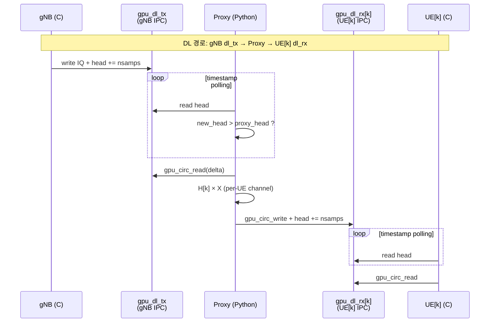
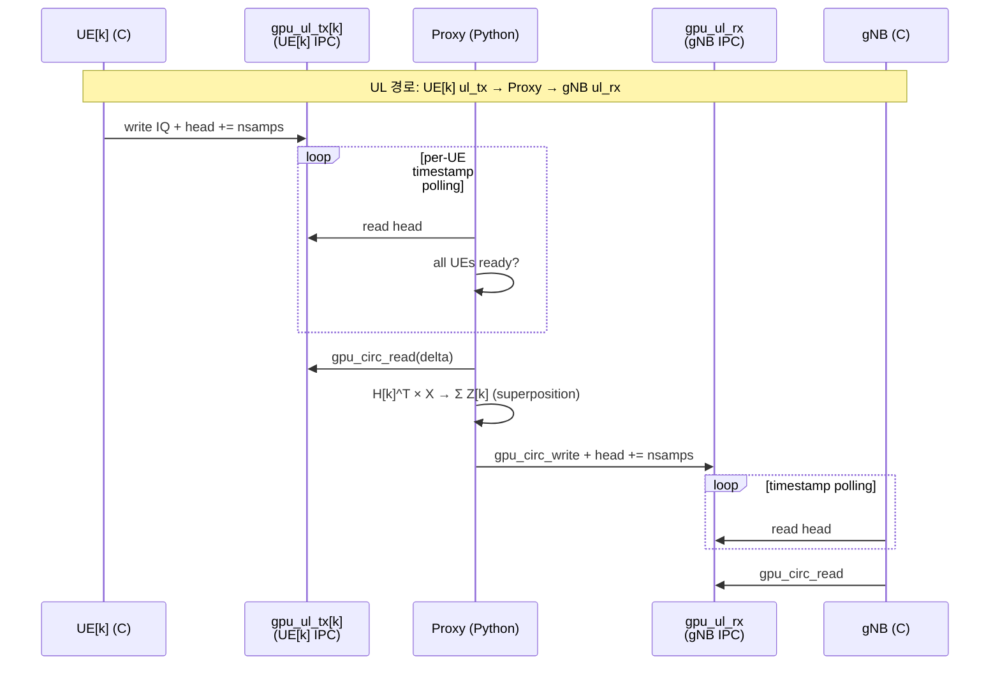
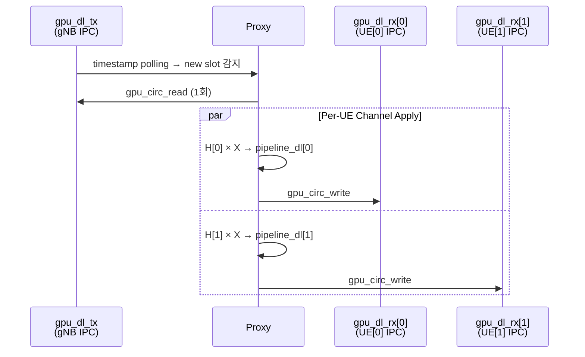
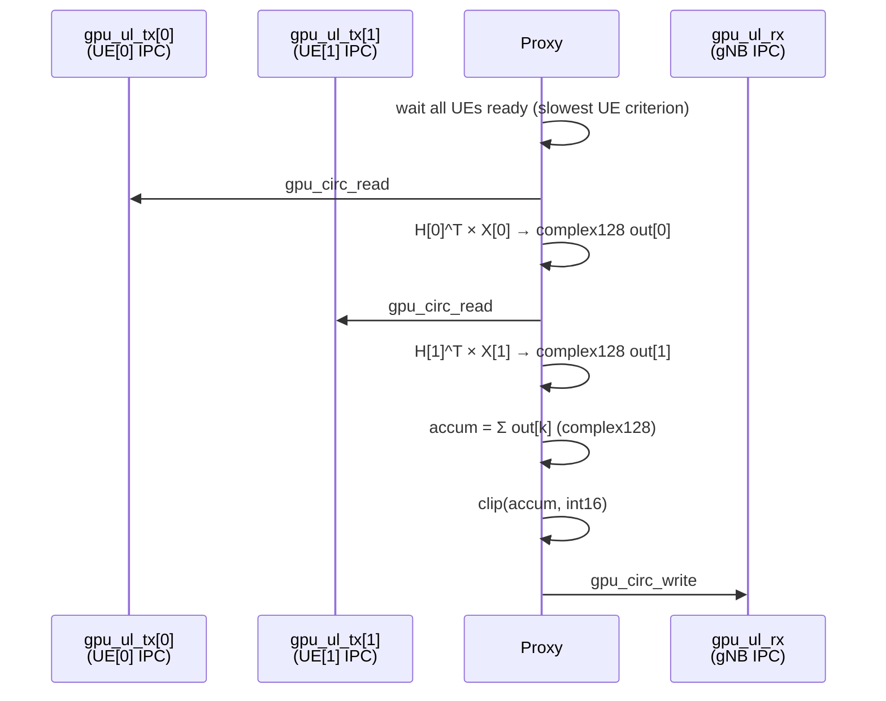
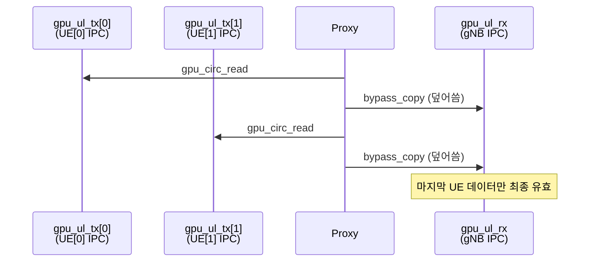
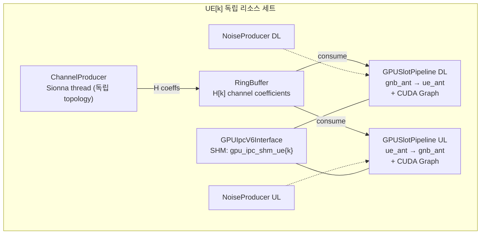

# G1C 아키텍처 상세

> [README.md](../README.md)로 돌아가기

## 목차

- [IPC V6 Multi-Instance 전략](#ipc-v6-multi-instance-전략)
- [GPU Circular Buffer 구조](#gpu-circular-buffer-구조-ipc-v6)
- [Multi-UE IPC 버퍼 전체 배치](#multi-ue-ipc-버퍼-전체-배치)
- [IQ 데이터 흐름 상세 (DL)](#iq-데이터-흐름-상세-dl-mimo-2×2)
- [IQ 데이터 흐름 상세 (UL Channel)](#iq-데이터-흐름-상세-ul-channel-mode-mimo-2×2)
- [IQ 데이터 흐름 상세 (UL Bypass)](#iq-데이터-흐름-상세-ul-bypass-mode)
- [Timestamp Polling 메커니즘](#timestamp-polling-메커니즘)
- [DL Broadcast / UL Superposition / UL Bypass 흐름](#dl-broadcast-흐름)
- [Per-UE 독립 리소스](#per-ue-독립-리소스)
- [C 코드 변경](#c-코드-변경-gpu_ipc_v6)
- [G1B v8 대비 변경사항](#g1b-v8-대비-변경사항)

---

## IPC V6 Multi-Instance 전략

기존 IPC V6를 재사용하되, UE별로 독립 SHM 인스턴스를 생성:

| 인스턴스 | SHM 경로 | 사용 버퍼 | 미사용 (메모리 낭비) |
|----------|----------|-----------|---------------------|
| gNB | `/tmp/oai_gpu_ipc/gpu_ipc_shm` | dl_tx, ul_rx | dl_rx, ul_tx |
| UE[k] | `/tmp/oai_gpu_ipc/gpu_ipc_shm_ue{k}` | dl_rx, ul_tx | dl_tx, ul_rx |

## GPU Circular Buffer 구조 (IPC V6)

IPC V6의 각 버퍼는 **GPU circular buffer**로, timestamp 기반 인덱싱을 사용한다.

```
┌─────────────────────────────────────────────────────────────────────┐
│  IPC V6 인스턴스 1개 = GPU 버퍼 4개 + SHM 메타데이터 (4KB)         │
│                                                                     │
│  SHM (4KB): CUDA IPC handles × 4 + head/tail timestamps            │
│             + magic(0x47505537) + version + nbAnt per buffer        │
│                                                                     │
│  GPU Circular Buffer (per buffer):                                  │
│  ┌──────────────────────────────────────────────────────────────┐   │
│  │  cir_size = cir_time × nbAnt  (예: 460800 × 2 = 921600)    │   │
│  │                                                              │   │
│  │  int16 samples, interleaved: [s*nbAnt + a]                  │   │
│  │                                                              │   │
│  │  ◄──── cir_time (460800 samples = ~15ms @30.72MHz) ────►   │   │
│  │  ┌────┬────┬────┬────┬ ─ ─ ─ ─ ─ ─ ─ ─ ─ ┬────┬────┐      │   │
│  │  │s0a0│s0a1│s1a0│s1a1│                     │sNa0│sNa1│      │   │
│  │  └────┴────┴────┴────┴ ─ ─ ─ ─ ─ ─ ─ ─ ─ ┴────┴────┘      │   │
│  │   ▲                                                          │   │
│  │   └── offset = (timestamp % cir_time) × nbAnt               │   │
│  └──────────────────────────────────────────────────────────────┘   │
└─────────────────────────────────────────────────────────────────────┘

  s = IQ sample index (I,Q 각각 int16)
  a = antenna index (0 ~ nbAnt-1)
  nbAnt = gNB 안테나 수 (dl_tx, ul_rx) 또는 UE 안테나 수 (dl_rx, ul_tx)
```

## Multi-UE IPC 버퍼 전체 배치

G1C에서는 1개 gNB IPC + N개 UE IPC = **총 4+4N 개의 GPU circular buffer**가 할당된다.

```
GPU Memory Layout (2 UE, 2×2 MIMO 예시)
═══════════════════════════════════════════════════════════════════════

 IPC gNB (gpu_ipc_shm)                    ← Proxy가 SERVER로 생성
 ┌───────────────────────────────────┐
 │ dl_tx  [cir=921600, 2ant] ◄── gNB writes (DL 송신)
 │ dl_rx  [cir=921600, 2ant]    (미사용 — 낭비)
 │ ul_tx  [cir=921600, 2ant]    (미사용 — 낭비)
 │ ul_rx  [cir=921600, 2ant] ──► gNB reads  (UL 수신)
 └───────────────────────────────────┘

 IPC UE[0] (gpu_ipc_shm_ue0)              ← Proxy가 SERVER로 생성
 ┌───────────────────────────────────┐
 │ dl_tx  [cir=921600, 2ant]    (미사용 — 낭비)
 │ dl_rx  [cir=921600, 2ant] ──► UE[0] reads  (DL 수신)
 │ ul_tx  [cir=921600, 2ant] ◄── UE[0] writes (UL 송신)
 │ ul_rx  [cir=921600, 2ant]    (미사용 — 낭비)
 └───────────────────────────────────┘

 IPC UE[1] (gpu_ipc_shm_ue1)              ← Proxy가 SERVER로 생성
 ┌───────────────────────────────────┐
 │ dl_tx  [cir=921600, 2ant]    (미사용 — 낭비)
 │ dl_rx  [cir=921600, 2ant] ──► UE[1] reads  (DL 수신)
 │ ul_tx  [cir=921600, 2ant] ◄── UE[1] writes (UL 송신)
 │ ul_rx  [cir=921600, 2ant]    (미사용 — 낭비)
 └───────────────────────────────────┘

 총 GPU 메모리: 12 buffers × 921600 × 2B = ~21MB (이 중 6개만 사용, 6개 낭비)
```

## IQ 데이터 흐름 상세 (DL, MIMO 2×2)

gNB에서 UE까지 DL IQ 샘플이 이동하는 전체 경로:

```
OAI gNB (nr-softmodem)
  │
  │  trx_write(): DL IQ를 interleave하여 gpu_dl_tx에 기록
  │  format: int16[s*nbAnt + a]  (s=time sample, a=antenna)
  │  예: [s0_ant0, s0_ant1, s1_ant0, s1_ant1, ...]  (2-ant interleave)
  │
  ▼
┌─────────────────────────────────────────────────────────────────────┐
│  gpu_dl_tx (gNB IPC circular buffer)                                │
│  int16 × 30720×2 samples/slot = 122880 int16 per slot              │
│  timestamp head가 증가하면 Proxy가 감지                              │
└───────────────────────────┬─────────────────────────────────────────┘
                            │  Proxy: timestamp polling → new slot 감지
                            ▼
┌─────────────────────────────────────────────────────────────────────┐
│  Proxy _ipc_dl_broadcast()                                          │
│                                                                     │
│  1. gpu_circ_read: dl_tx → raw int16[30720×2]  (1회, gNB 공유)     │
│                                                                     │
│  ┌─ for k in range(N): ──────────────────────────────────────────┐  │
│  │                                                                │  │
│  │  2. de-interleave: int16[30720×2] → (30720, N_t, 2)          │  │
│  │     → complex128: (30720, N_t)                                │  │
│  │                                                                │  │
│  │  3. OFDM extract: GPU index array로 14심볼 추출               │  │
│  │     → (14, N_t, 2048)                                         │  │
│  │                                                                │  │
│  │  4. FFT: (14, N_t, 2048) → Xf (주파수 도메인)                │  │
│  │                                                                │  │
│  │  5. Channel: Yf = Σ_t H_k[s,r,t,f] × Xf[s,t,f]             │  │
│  │     H_k: (14, N_r, N_t, 2048) from RingBuffer[k]             │  │
│  │     Yf:  (14, N_r, 2048)              ← CUDA Graph replay     │  │
│  │                                                                │  │
│  │  6. IFFT: Yf → time domain (14, N_r, 2048)                   │  │
│  │                                                                │  │
│  │  7. OFDM reconstruct: GPU index scatter                       │  │
│  │     → (30720, N_r) → PL → AWGN                               │  │
│  │                                                                │  │
│  │  8. re-interleave + clip: complex128 → int16[30720×2]         │  │
│  │                                                                │  │
│  │  9. gpu_circ_write: → gpu_dl_rx[k] (UE[k] IPC)              │  │
│  └────────────────────────────────────────────────────────────────┘  │
└─────────────────────────────────────────────────────────────────────┘
                            │
          ┌─────────────────┼─────────────────┐
          ▼                 ▼                 ▼
┌──────────────┐  ┌──────────────┐  ┌──────────────┐
│ gpu_dl_rx[0] │  │ gpu_dl_rx[1] │  │gpu_dl_rx[N-1]│
│ UE[0] IPC    │  │ UE[1] IPC    │  │ UE[N-1] IPC  │
└──────┬───────┘  └──────┬───────┘  └──────┬───────┘
       ▼                 ▼                 ▼
  OAI UE[0]         OAI UE[1]        OAI UE[N-1]
  trx_read()        trx_read()        trx_read()
  de-interleave     de-interleave     de-interleave
```

## IQ 데이터 흐름 상세 (UL Channel Mode, MIMO 2×2)

N개 UE에서 gNB까지 UL IQ 샘플이 합산되어 전달되는 경로:

```
  OAI UE[0]         OAI UE[1]        OAI UE[N-1]
  trx_write()       trx_write()       trx_write()
  interleave        interleave        interleave
       │                 │                 │
       ▼                 ▼                 ▼
┌──────────────┐  ┌──────────────┐  ┌──────────────┐
│ gpu_ul_tx[0] │  │ gpu_ul_tx[1] │  │gpu_ul_tx[N-1]│
│ UE[0] IPC    │  │ UE[1] IPC    │  │ UE[N-1] IPC  │
└──────┬───────┘  └──────┬───────┘  └──────┬───────┘
       │                 │                 │
       └─────────────────┼─────────────────┘
                         │  Proxy: slowest UE criterion
                         ▼  (모든 UE timestamp ≥ target 대기)
┌─────────────────────────────────────────────────────────────────────┐
│  Proxy _ipc_ul_combine() → _ipc_ul_superposition_slot()            │
│                                                                     │
│  accum = zeros(complex128, 30720 × N_r)   ← gNB 안테나 기준        │
│                                                                     │
│  ┌─ for k in range(N): ──────────────────────────────────────────┐  │
│  │                                                                │  │
│  │  1. gpu_circ_read: ul_tx[k] → int16[30720×2]                 │  │
│  │                                                                │  │
│  │  2. de-interleave → complex128: (30720, N_t_ue)               │  │
│  │                                                                │  │
│  │  3. OFDM extract → FFT → (14, N_t_ue, 2048)                  │  │
│  │                                                                │  │
│  │  4. Channel: Zf_k = Σ_t H_k^T[s,r,t,f] × Xf[s,t,f]         │  │
│  │     H_k^T: (14, N_r_gnb, N_t_ue, 2048)    ← CUDA Graph      │  │
│  │     Zf_k:  (14, N_r_gnb, 2048)                                │  │
│  │                                                                │  │
│  │  5. IFFT → OFDM reconstruct → (30720, N_r_gnb)               │  │
│  │                                                                │  │
│  │  6. accum += pipeline_ul[k].gpu_out  (complex128 합산)        │  │
│  └────────────────────────────────────────────────────────────────┘  │
│                                                                     │
│  7. clip(accum, int16_max) → re-interleave → int16[30720×2]       │
│                                                                     │
│  8. gpu_circ_write: → gpu_ul_rx (gNB IPC)                         │
└─────────────────────────────────────────────────────────────────────┘
                            │
                            ▼
┌─────────────────────────────────────────────────────────────────────┐
│  gpu_ul_rx (gNB IPC circular buffer)                                │
│  Proxy가 timestamp 갱신 → gNB가 감지                                │
└───────────────────────────┬─────────────────────────────────────────┘
                            │
                            ▼
                      OAI gNB (nr-softmodem)
                      trx_read(): UL IQ 수신
                      de-interleave → L1 처리
```

## IQ 데이터 흐름 상세 (UL Bypass Mode)

```
  OAI UE[0]         OAI UE[1]
       │                 │
       ▼                 ▼
┌──────────────┐  ┌──────────────┐
│ gpu_ul_tx[0] │  │ gpu_ul_tx[1] │
└──────┬───────┘  └──────┬───────┘
       │                 │
       ▼                 ▼
┌─────────────────────────────────────────────────────────────────────┐
│  Proxy _ipc_ul_combine() — bypass mode                              │
│                                                                     │
│  for k in range(N):                                                 │
│    bypass_copy: gpu_ul_tx[k] ──copy──► gpu_ul_rx (gNB)             │
│                                                                     │
│  ※ 채널 미적용, 각 UE가 순차적으로 gNB ul_rx를 덮어씀               │
│  ※ 최종적으로 UE[N-1]의 데이터만 gNB에 유효                         │
└───────────────────────────┬─────────────────────────────────────────┘
                            ▼
                      gpu_ul_rx (gNB IPC)
                            │
                            ▼
                      OAI gNB trx_read()
```

## Timestamp Polling 메커니즘





## DL Broadcast 흐름



## UL Superposition 흐름 (Channel Mode)



## UL Bypass 흐름



## Per-UE 독립 리소스

각 UE는 완전히 독립된 리소스를 가짐:



## C 코드 변경 (gpu_ipc_v6)

`gpu_ipc_v6.c`의 `gpu_ipc_v6_init()`에서 UE 역할일 때 `RFSIM_GPU_IPC_UE_IDX` 환경변수를 읽어 per-UE SHM 경로 생성:

```c
// UE role: RFSIM_GPU_IPC_UE_IDX=k → /tmp/oai_gpu_ipc/gpu_ipc_shm_ue{k}
// gNB role: 기본 경로 유지 → /tmp/oai_gpu_ipc/gpu_ipc_shm
```

`gpu_ipc_v6_ctx_t`에 `char shm_path[256]` 필드 추가.

**빌드 필요**: C 코드 변경 후 OAI 재빌드 필수.

```bash
cd ~/DevChannelProxyJIN/openairinterface5g_whan/cmake_targets
./build_oai --gNB --nrUE -w SIMU --ninja --build-lib "telnetsrv"
```

## G1B v8 대비 변경사항

| 항목 | G1B v8 | G1C v0 |
|------|--------|--------|
| UE 수 | 1 | N (--num-ues) |
| IPC 인스턴스 | 1 | 1 + N |
| SHM 파일 | gpu_ipc_shm | gpu_ipc_shm + gpu_ipc_shm_ue{k} |
| DL 처리 | 1:1 | 1:N broadcast |
| UL 처리 | 1:1 | N:1 superposition/bypass |
| 파이프라인 | DL 1개 + UL 1개 | DL N개 + UL N개 |
| 채널 생성 | 1 producer | N producers |
| GPU 메모리 | 4 buffers | 4 + 4N buffers |
| C 코드 | gpu_ipc_v6 | + RFSIM_GPU_IPC_UE_IDX 지원 |
